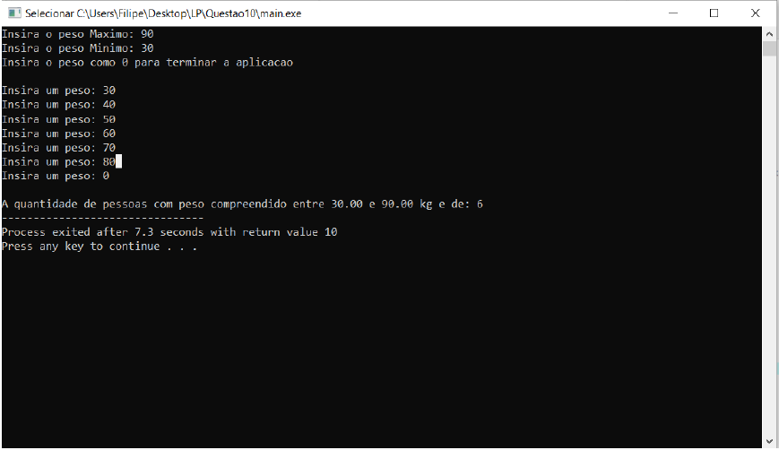

# Pesos-2.0
### Recolha de input do utilizador e resumo acerca dos dados compreendidos numa variavel escolhida pelo próprio utilizador
Trabalho desenvolvido para cimentar os conhecimentos adquiridos nas cadeiras de Linguagens de Programação e Algoritmos e Estruturas de Dados.

**O objetivo da aplicação é que receba uma quantidade indefinida de informação sobre o peso de pessoas e que dê ao utilizador a possibilidade de escolher ele outros intervalos de peso**

Se quiser utilizar o programa basta:
* Executar o ficheiro denominado "main.exe".

Aqui tem um exemplo do programa em execução:

